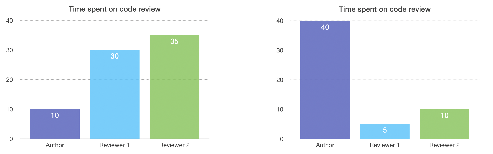
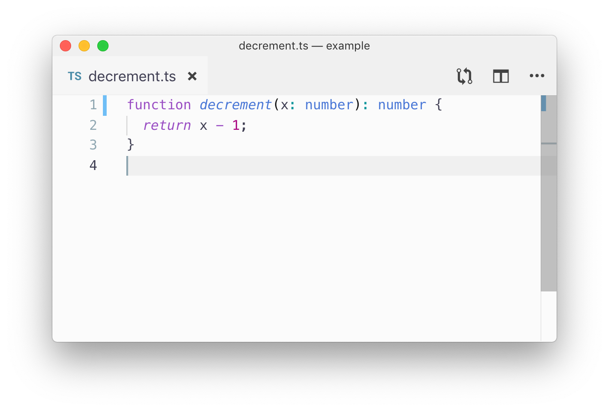
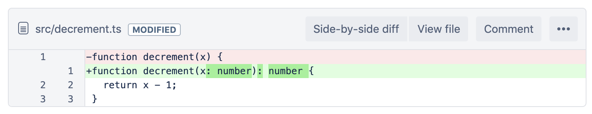

As a pull request (PR) author, it’s great to structure your PR in a way that’s easy for reviewers to review.

The theory is that, by _investing your time up front_, you save time for your ✨ _team as a whole_. ✨

---

**LEFT:** Author that did not structure their PR 😞 **RIGHT:** Author that did structure their PR 🙂



_According to this data from a questionable source, structuring your PRs will save your team 20 time units._

---

In this blog post, I’m going to share a few of my favorite techniques for structuring PRs! I’ve split them up into 3 categories.

- **Commit history:** Two techniques I use for rewriting history
- **Commit messages:** Template for filling out commit messages
- **Pull request creation:** Description, screenshots and comments

To keep this post beginner-friendly, I’ll share each `git` command used. That said, I recommend reading about [git rebase](https://www.atlassian.com/git/tutorials/rewriting-history/git-rebase) first if you’re not familiar with it.

---

## Commit history

For me, it’s implausible to have good commit history when I’m done developing a feature. I always try to do it, and I’m relatively successful at first. But then my code doesn’t work. And then, once I’m happy with the code, my commit history looks like this!


Thankfully, I can control what my commit history looks like before I open a PR! 👏

---

### Technique 1: Reset and patch

This is my favorite technique, since it’s quick, easy and works for most use cases.

The technique involves resetting my entire commit history and starting over. I run the following `git` CLI commands:

- `git checkout -b branch-name-after-rebase`
  - Create a new branch, in case I mess things up. (I know I can use the reflog to get back into a good state. Having another branch just makes me feel safer ok 😅)
- `git fetch`
- `git rebase origin/master`
  - Keep my branch up-to-date with master. Optional, but I’d rather fix any conflicts now. (If you run into the same conflict multiple times, I recommend [squashing into one commit](https://stackoverflow.com/questions/5189560/squash-my-last-x-commits-together-using-git/5189600) before rebasing on origin/master.)
- `git reset origin/master`
  - Remove all my commits, but leave my changes on the filesystem.

Afterward, it will look like I made all of my changes, but haven’t actually committed anything.

```bash
daniel@macbook ~/example (add-increment-by-amount-util-function) $ git fetch
daniel@macbook ~/example (add-increment-by-amount-util-function) $ git rebase origin/master
Current branch add-increment-by-amount-util-function is up to date.
daniel@macbook ~/example (add-increment-by-amount-util-function) $ git reset origin/master
Unstaged changes after reset:
M	src/__tests__/utils.tests.js
M	src/utils.js
daniel@macbook ~/example (add-increment-by-amount-util-function) $ git status
On branch add-increment-by-amount-util-function
Your branch is behind 'origin/add-increment-by-amount-util-function' by 3 commits, and can be fast-forwarded.
  (use "git pull" to update your local branch)

Changes not staged for commit:
  (use "git add <file>..." to update what will be committed)
  (use "git checkout -- <file>..." to discard changes in working directory)

	modified:   src/__tests__/utils.tests.js
	modified:   src/utils.js

no changes added to commit (use "git add" and/or "git commit -a")
daniel@macbook ~/example (add-increment-by-amount-util-function) $
```

```diff
diff --git a/src/utils.js b/src/utils.js
index 91867c3..892aa17 100644
--- a/src/utils.js
+++ b/src/utils.js
@@ -2,11 +2,21 @@ function increment(x) {
   return x + 1;
 }

+function incrementByAmount(x, amount) {
+  return x + amount;
+}
+
 function decrement(x) {
   return x - 1;
 }

+function decrementByAmount(x, amount) {
+  return x - amount;
+}
+
:
```

I have no commit history now, so I need to re-commit my changes. Before I do that, let’s take a brief detour. We need to decide what we want our commit history to look like at the end.

[[info | What does a good commit history look like?]]
|
| I find that my individual commits often don’t map to individual files—they instead involve small related chunks across multiple files.
|
| _For example…_
|
| ✅ **Good commit 1:** Add a new function `incrementByAmount` to `utils.js` and a test to `utils.tests.js`.
|
| ✅ **Good commit 2:** Add another new function `decrementByAmount` to `utils.js` and a test to `utils.tests.js`.
|
| _Compare that with…_
|
| 🚫 **Bad commit 1:** Add two functions to `utils.js`.
|
| 🚫 **Bad commit 2:** Add tests to `utils.tests.js`.
|
| When viewing one of the “bad commits” individually, the reviewer may be thinking “are they going to test this function?” or “what function is this test testing?”
|
| (For a small change like this, unstructured commits aren’t a big deal. Larger PRs, however, may contain a lot of unrelated changes within one file. While that may also be a sign that the file needs re-architecting, that’s out of scope for this post.)

Following those guidelines, I’ll need to stage only _some_ changes from any given file. I like to use:

- `git add -p` (or `--patch`)
  - This command steps me through each change, and I just type `y(es)` or `n(o)` to stage individual changes.
  - You don't need to use the `git` CLI. My coworkers have recommended using Tower or Sourcetree.

Here, I’ll stage only the `increment` functions, but leave the `decrement` functions for the next commit.

ADD VIDEO HERE?

```diff
daniel@macbook ~/example (add-increment-by-amount-util-function) $ git add -p
diff --git a/src/__tests__/utils.tests.js b/src/__tests__/utils.tests.js
index 0d7326c..a3f5326 100644
--- a/src/__tests__/utils.tests.js
+++ b/src/__tests__/utils.tests.js
@@ -19,6 +19,16 @@ describe("utils", () => {
     });
   });

+  describe("incrementByAmount", () => {
+    it("should increment by 1000", () => {
+      const number = -2;
+
+      const incrementedNumber = incrementByAmount(number, 1000);
+
+      expect(incrementedNumber).toBe(9998);
+    });
+  });
+
   describe("decrement", () => {
     it("should decrement a positive number", () => {
       const number = 2;
Stage this hunk [y,n,q,a,d,j,J,g,/,e,?]? y
@@ -36,4 +46,14 @@ describe("utils", () => {
       expect(decrementedNumber).toBe(-3);
     });
   });
+
+  describe("decrementByAmount", () => {
+    it("should decrement by 1000", () => {
+      const number = -2;
+
+      const decrementedNumber = decrementByAmount(number, 1000);
+
+      expect(decrementedNumber).toBe(-1002);
+    });
+  });
 });
Stage this hunk [y,n,q,a,d,K,g,/,e,?]? n

diff --git a/src/utils.js b/src/utils.js
index 91867c3..99cbc75 100644
--- a/src/utils.js
+++ b/src/utils.js
@@ -2,10 +2,18 @@ function increment(x) {
   return x + 1;
 }

+function incrementByAmount(x, amount) {
+  return x + amount;
+}
+
 function decrement(x) {
   return x - 1;
 }

+function decrementByAmount(x, amount) {
+  return x - amount;
+}
+
 module.exports = {
   increment,
   decrement
Stage this hunk [y,n,q,a,d,s,e,?]? s
Split into 2 hunks.
@@ -2,7 +2,11 @@
   return x + 1;
 }

+function incrementByAmount(x, amount) {
+  return x + amount;
+}
+
 function decrement(x) {
   return x - 1;
 }

Stage this hunk [y,n,q,a,d,j,J,g,/,e,?]? y
@@ -5,7 +9,11 @@
 function decrement(x) {
   return x - 1;
 }

+function decrementByAmount(x, amount) {
+  return x - amount;
+}
+
 module.exports = {
   increment,
   decrement
Stage this hunk [y,n,q,a,d,K,g,/,e,?]? n

daniel@macbook ~/example (add-increment-by-amount-util-function) $ git status
On branch add-increment-by-amount-util-function
Your branch is behind 'origin/add-increment-by-amount-util-function' by 3 commits, and can be fast-forwarded.
  (use "git pull" to update your local branch)

Changes to be committed:
  (use "git reset HEAD <file>..." to unstage)

	modified:   src/__tests__/utils.tests.js
	modified:   src/utils.js

Changes not staged for commit:
  (use "git add <file>..." to update what will be committed)
  (use "git checkout -- <file>..." to discard changes in working directory)

	modified:   src/__tests__/utils.tests.js
	modified:   src/utils.js

daniel@macbook ~/example (add-increment-by-amount-util-function) $
```

After that, it’s time to git commit the staged changes. I’ll repeat `git add -p` and `git commit` until all my changes have been committed, then I’m ready to open a PR! 🙌

---

### Technique 2: Put “moved code” in its own commit

For more complex PRs, my _Reset and patch_ technique isn’t enough. This usually happens when I moved a lot of code around.

To illustrate, let’s say I decide to move `decrement` to its own file, rather than keeping it in `utils.js` (it is very different from the other functions in that file, after all 😂)

Since I’ve decided to use TypeScript for new files in this repo, I also move it into a TypeScript file and rewrite it in TypeScript. The diff looks like this:


```diff
src/decrement.ts ADDED

Side-by-side diff View file

Comment

More
+function decrement(x: number): number {
+  return x - 1;
+}
File src/utils.js MODIFIED

Side-by-side diff View file

Comment

More
   return x + amount;
 }

-function decrement(x) {
-  return x - 1;
-}
-
 function decrementByAmount(x, amount) {
   return x - amount;
 }
```

With this small example, it’s not terrible—but with larger examples, it’s hard to tell that the `return x - 1` line stayed the same, while the `function` line changed. The reviewer can’t easily see what code was _moved_ and what code was _changed_.

**How can we make this easier on the reviewer?**

What if I split it into 2 commits, where the first commit moved the code, then the second commit made the changes to the _function_ line? That way, the reviewer can ignore the first commit’s line-by-line diff and focus on reviewing the second commit.

---

This “history rewrite” is a little more tricky, since it requires committing an “in between” state that doesn’t match your final code changes.

To start with, we’ll run an interactive rebase, which allows us to change commits.

- `git rebase -i origin/master`

In the editor that pops up, change the commit we want to split from `pick` to `edit` (press `i` to enter insert mode in vim). That means the rebase will stop and let us edit the commit.

```bash
pick 165cfa2 add incrementByAmount
pick 95c2b9e add decrementByAmount
edit 356409a move decrement from utils.js to decrement.ts
pick b418d55 add a dependency

# Rebase 18e678f..b418d55 onto 18e678f (4 commands)
#
# Commands:
# p, pick <commit> = use commit
# r, reword <commit> = use commit, but edit the commit message
# e, edit <commit> = use commit, but stop for amending
# s, squash <commit> = use commit, but meld into previous commit
# f, fixup <commit> = like "squash", but discard this commit's log message
# x, exec <command> = run command (the rest of the line) using shell
# b, break = stop here (continue rebase later with 'git rebase --continue')
# d, drop <commit> = remove commit
# l, label <label> = label current HEAD with a name
# t, reset <label> = reset HEAD to a label
# m, merge [-C <commit> | -c <commit>] <label> [# <oneline>]
# .       create a merge commit using the original merge commit's
# .       message (or the oneline, if no original merge commit was
# .       specified). Use -c <commit> to reword the commit message.
#
# These lines can be re-ordered; they are executed from top to bottom.
```

Save the rebase plan, and it will stop right after the edit commit. (`Esc`, `:wq`, `Enter` in vim, or [stop trying and configure git to use a different editor](https://stackoverflow.com/questions/2596805/how-do-i-make-git-use-the-editor-of-my-choice-for-commits) 😂)

Now, the commit has still been committed, but we can _amend_ it. I’ll amend the commit to only _move_ the code, by undoing the implementation changes I made.

Personally, I like load the old file in Bitbucket in a web browser, then copy and paste the old implementation overtop my new implementation\*1:


```ts
// decrement.ts

function decrement(x) {
  return x - 1;
}
```

Then I save, and:

- `git add decrement.ts`
- `git commit --amend`
  - This replaces the commit with a different commit. In this case, the replacement commit will only contain the code movement, not the implementation change. At this point, my implementation changes are “lost.”

After that, I undo (⌘-Z) 😂 my “paste” to recover my new implementation:



```ts
// decrement.ts

function decrement(x: number): number {
  return x - 1;
}
```

and I add this “implementation change” as a new commit:

- `git add decrement.ts`
- `git commit`

Now we’re done with this part of the rebase! Run this command to finish up.

- `git rebase --continue`

---

Now, if you look at the commit diffs, you’ll see two separate commits:

First, one that just moves code:


```diff
File src/decrement.ts ADDED

Side-by-side diff View file

Comment

More
+function decrement(x) {
+  return x - 1;
+}
File src/utils.js MODIFIED

Side-by-side diff View file

Comment

More
   return x + amount;
 }

-function decrement(x) {
-  return x - 1;
-}
-
 function decrementByAmount(x, amount) {
   return x - amount;
 }
```

Followed by one that only changes code:



```diff
File src/decrement.ts MODIFIED

Side-by-side diff View file

Comment

More
-function decrement(x) {
+function decrement(x: number): number {
   return x - 1;
 }
```

Looks good! The reviewer doesn’t have to manually scan for what changed between the two implementations\*2.

- _(\*1) I’m sure there is a better way to add a “midpoint” commit (please share if you have one), but one benefit of rewriting history is that no one knows how hackily you did it._
- _(\*2) I wonder if there are any tools for visually viewing diffs better. What if Bitbucket identified code that moved, and offered a “changes after movement” diff?_

---

### Technique 3: Honorable mention: Do nothing

I leave this here non-sarcastically 😂. For some PRs, if rewriting commit history isn’t worth the value it provides to reviewers, then don’t do it. That’s a tradeoff for you and your team to decide 🙂

---

## Commit messages

Now that I’ve restructured my commits, I can go back and write commit messages! (yes I really do everything at the last minute!)

- `git rebase -i origin/master`
  - set every commit to `reword` (or `r`)

```bash
reword 165cfa2 add incrementByAmount
reword 95c2b9e add decrementByAmount
reword f49cec2 move decrement from utils.js to decrement.ts
reword 2df0152 make it into typescript syntax
reword e0d33f3 add a dependency

# Rebase 18e678f..e0d33f3 onto 18e678f (5 commands)
#
# Commands:
# p, pick <commit> = use commit
# r, reword <commit> = use commit, but edit the commit message
```

Now, one-by-one, it will let me rewrite my commit messages. _You can hide the fact that you exclusively use misspellings of “wrok in progrses” for commit messages_.

### Writing good commit messages

Let’s start with an example commit message, then I can describe how to write it.

```
Fix blog post header being too small in IE11

Problem
---

In IE11, the container doesn't keep its 100px minimum height
when the content is smaller. It looks fine in other browsers.

Cause
---

IE11 flexbox containers with min-height and align-items:center
don't work as expected:
https://developer.microsoft.com/en-us/microsoft-edge/platform/issues/101414/

Solution
---
Use workaround described here
https://github.com/philipwalton/flexbugs/issues/231#issuecomment-362790042

Create an ::after pseudo-element with height: 100px as a child
of the flex container.
```

I write my commit messages by starting out with a template, which helps me sort out my thoughts.

[[info | Commit message template]]
| ##### Problem
|
| What is the current behavior? Why is it undesirable?
|
| ##### Cause
|
| What was the technical cause for the undesirable behavior?
|
| ##### Solution
|
| What was the change you had to make to fix the behavior?
|
| _If you find yourself describing how the new code works, consider adding that as a code comment instead! Commit messages are more useful for understanding why something was changed, not how the new code works._
|
| ##### Other solutions attempted
|
| If you attempted a different solution that ended up not working, explain it here. Failed attempts are still useful knowledge for reviewers!
|
| _Same thing here. Consider if this could be a code comment._
|
| ##### Resources
|
| Consider if you can add any links to this commit message. Examples include:
|
| - A recent commit that caused the regression
| - A design mockup or screenshot
| - The bundle size change and license of a new dependency
| - A third-party bug (e.g. a chromium bug tracker link)
| - Tutorials, Stack Overflow questions, GitHub issues

I’ll fill that out, then delete any sections of the template I didn’t use. I don't necessarily follow the template at the end, but it helps jog my memory to remember why I wrote the code.

(One thing to note is the commit message summary, which is the first line of the template. There are a lot of recommendations to make this concise and specific, and whole blog posts about it. I'm personally not very good at these concise summaries, so my only advice here is to seek out other learning material on that subject. 😅)

Once I’ve updated all my commit messages, it’s time to move on to opening the PR!

---

## Pull request creation

I like to keep the description brief because [I have a theory that most people don’t really read them](https://en.wikipedia.org/wiki/Banner_blindness). I prefer sticking to one-liners, bullet points and screenshots:

```
Center images before cropping

Before


After


Administrative
QA Checklist

Test narrow / tall backgrounds

Test various file formats
```

---

### Call-to-action comments

Since the default view is “review by file” instead of “reviewing by commit,” I’ll add a call-to-action (a comment 😉) near the top of the PR:


By calling out the “commit-by-commit” review method, you can make sure that your effort rewriting history wasn’t wasted!

---

There are a few other line-specific call-to-actions you can add, to guide the reviewer through their ✨ experience ✨

**Example 1:** Make it clear when a large diff is caused only by whitespace changes.


---

**Example 2:** Asking for specific feedback.


That way, the reviewer has a sense of what parts of the code need more thorough review.

---

### Making changes after code review

After your reviewers have made suggestions, I usually don't want to rewrite history, since it makes it harder for them to see what changed.

In that case, I recommend using [`fixup` commits](https://thoughtbot.com/blog/autosquashing-git-commits). They allow you to clearly show reviewers what changed, but keep history clean when you're ready to merge the PR.

## Conclusion

To recap, you’ve learned my preferred techniques for making PRs easy to review.

Keep in mind that these are just self-taught techniques I’ve found useful—they’re definitely not an “““industry standard””” or anything. I’d love to hear other perspectives!
