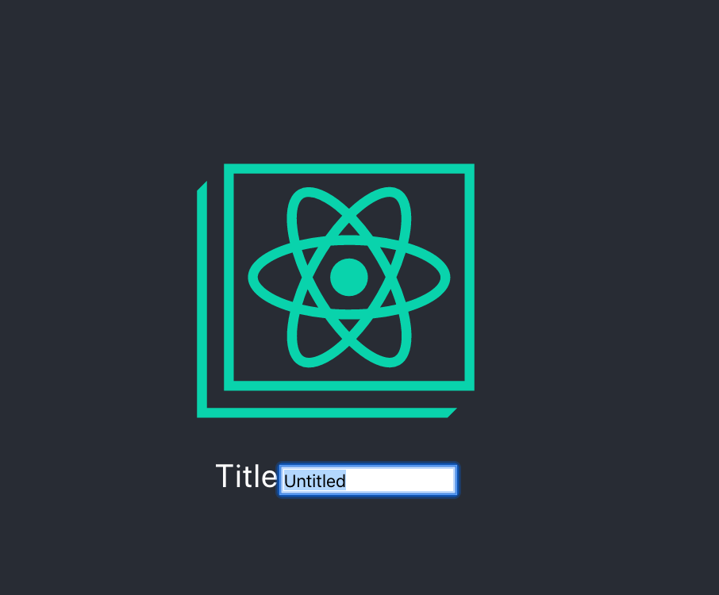

import InfoBlock from "../../components/custom-blocks/info-block";
import CssFocus from "./css-focus.mdx";
import Accessibility from "./accessibility.mdx";

Autofocusing is this super fun neat thing that you can do to make your app easier to use.


In this screenshot of [Trello](https://trello.com/), the user clicked the _Checklist_ button. It opened a menu, with the _Title_ text input autofocused and its text selected.

This makes it so the user doesn't have to click on the text input; they can just start typing.

There are a lot of different ways to autofocus a text input in React. In large apps with lots of legacy behavior, it's been tricky for me to find one method that always works.

## What is focus?


This input is `focus`ed, but no text is selected. If the user starts typing, the text they type will go into that input.

Only one element in a document can be focused at a time, and the focused element will receive keyboard events.

You can interactively see [which element is focused by running `document.activeElement`](https://developer.mozilla.org/en-US/docs/Web/API/DocumentOrShadowRoot/activeElement) in your console:


In this screenshot, `document.activeElement` is set to the Checklist Title input, as we'd expect.

<InfoBlock>
  <CssFocus />
</InfoBlock>

## Autofocus

Typically, an element gains focus by either:

- The user clicks on the element
- The user uses the "tab" keyboard key to move focus to the element

When I say autofocusing, I'm refering to focusing an element without direct user interaction. When done appropriately, autofocusing can simplify the user interface.

<Accessibility />

## Autofocus without React

Before we get into React, I'm going to discuss how to add autofocusing behavior with native DOM APIs. I think this makes the React portion of this blog post easier to understand.

There are two ways to manually focus an element:

- The [`autofocus` attribute on `input`s](https://developer.mozilla.org/en-US/docs/Web/HTML/Element/input#autofocus) and [`textarea`s](https://developer.mozilla.org/en-US/docs/Web/HTML/Element/textarea).
- The [`focus()` method on `HTMLElement`s](https://developer.mozilla.org/en-US/docs/Web/API/HTMLOrForeignElement/focus).

### autofocus attribute

Let's start with the `autofocus` attribute. To use it, you'd could create a raw HTML page like this, and declaratively specify that the input should autofocus when it appears:

```html
<!DOCTYPE html>
<html>
  <head> </head>
  <body>
    <label>
      Title
      <input type="text" autofocus value="Untitled" />
    </label>
  </body>
</html>
```

Open this file in your browser and you'll see this:


Nice! That's what we wanted.

---

Does `autofocus` only work for page load? What if you imperatively add an element with `autofocus` to the DOM later? Let's try it out.

This example adds an autofocused input to the page 5 seconds after load:

```html
<!DOCTYPE html>
<html>
  <head> </head>
  <body>
    <label>
      Title
      <!-- input will get appended here -->
    </label>

    <script>
      const input = document.createElement("input");
      input.setAttribute("autofocus", "");

      setTimeout(() => {
        document.querySelector("label").appendChild(input);
      }, 5000);
    </script>
  </body>
</html>
```

Load the page, wait 5 seconds. [You'll get different behavior depending on the browser you're using](https://github.com/facebook/react/issues/11851#issuecomment-351672131).

- **Firefox** will not focus the element.
- **Safari** will focus the element, regardless of if there are any other `autofocus` elements already in the document.
- **Chrome** will focus the element, but only if there are no other `autofocus` elements already in the document.

(The HTML spec [requires that there must not be two elements with `autofocus` in the same document](https://www.w3.org/TR/html52/sec-forms.html#autofocusing-a-form-control-the-autofocus-attribute), so Chrome's and Safari's behaviors are probably equally correct 🤷🏼‍♂️.)

Oof.

### Calling focus()

If you don't want to use the `autofocus` attribute (which I hope you don't, at this point 😂), there is a more imperative method: Calling `focus()` on the DOM element.

```html
<!DOCTYPE html>
<html>
  <head> </head>
  <body>
    <label>
      Title
      <input type="text" value="Untitled" />
    </label>

    <script>
      const input = document.querySelector("input");
      input.focus();
    </script>
  </body>
</html>
```

In this example, we don't have an `autofocus` attribute. However, we get the same behavior by finding the input and calling `focus` on it.

`focus()` is also more versatile than `autofocus`, since you can call it at any time. Maybe you want an input to focus after a button click, rather than right when it appears in the DOM.

---

Is `focus()` the perfect solution we've been looking for? Maybe! The main difficulty I've had with it is calling `focus()` at the "right time." For example, calling `focus()` before the element is attached to the DOM does nothing:

```js
const input = document.createElement("input");

// Does not work!
input.focus();

document.querySelector("label").appendChild(input);

// Works!
input.focus();
```

That might seem obvious! Of course you can't focus something that isn't visible. But, it can be harder to isolate if your app has a lot of moving parts. For example, in our app, we sometimes integrate new React components into legacy code like this:

```js
const root = document.createElement("div");
ReactDOM.render(<App />, root);
document.body.appendChild(root);
```

Notice that we render the React component on a detached element, then _later_ attach it to the DOM. It's the same idea as above, but more indirect.

---

I'll cover two more small topics, then we can move on to React.

### select()

Up to this point, I've been blurring (😂) together the concepts of focusing and selecting.


This input is `focus`ed _and_ all of its text is selected. `window.getSelection()` [allows you to see what text is selected](https://developer.mozilla.org/en-US/docs/Web/API/Window/getSelection).

Selecting text in an input can only be done imperatively with the `select()` method—there is not a declarative `autoselect` attribute.

To do it, you'd take the previous example, then add `select()` afterward.

```js
const input = document.querySelector("input");
input.focus();
input.select();
```


It selected! This is useful in situations where the text input has a "default" value pre-filled, but you want the user to be able to easily clear it.

### blur events

While blur events aren't really relevant to the blog post, I want to make sure you're aware of the concept. In a sense, the `blur` event the inverse of the `focus` event. [When an input _loses_ focus, a `blur` event is triggered on that input](https://developer.mozilla.org/en-US/docs/Web/API/Element/blur_event).

That's all I'll cover here. Just don't think we're talking about blurry images ;)

---

## Time to do autofocusing in React!

Ok! Now that you understand how to autofocus text inputs with just the DOM and raw HTML pages, we can move on to React.

I'm going to go over a variety of methods—each have their use cases.

### autoFocus prop

The simplest method involves using the `autoFocus` prop on `input` elements ([Notice the uppercase F](https://reactjs.org/docs/dom-elements.html)). It's similar to the `autofocus` attribute we learned about earlier.

```jsx
const MyComponent = () => (
  <label>
    Title
    <input type="text" defaultValue="Untitled" autoFocus />
  </label>
);
```

Run that, and you'll see that the input autofocuses when the component mounts.


Looks good! If you want to also autoselect the text in the input, you can add an `onFocus` event:

```jsx
<input
  type="text"
  defaultValue="Untitled"
  autoFocus
  onFocus={e => e.currentTarget.select()}
/>
```



That way, whenever the input is focused, all its text will be selected as well.

---

### How does it work?

Interestingly, if you inspect the DOM, you won't see an `autofocus` attribute on the input element:


That's odd! Turns out the React team decided the `autofocus` attribute had [too many cross-browser inconsistencies, so they polyfilled the behavior](https://github.com/facebook/react/issues/11851#issuecomment-351672131). When you pass an `autoFocus` prop, React will internally call `focus()` when the `input` element mounts.

### Does it always work?

There's one situation where I find that this doesn't work. Recall that I mentioned earlier how we render React components into legacy parts of our app:

```js
const root = document.createElement("div");
ReactDOM.render(<App />, root);

// ...

someContainer.appendChild(root);
```

If you render your React component into a detached DOM node, React will call `focus()` too soon. This will result in the `input` not focusing when your React tree becomes visible.

We _could_ refactor the parts of our app where we combine React and non-React code. However, for the purposes of learning, I'm going to talk about some workarounds we can do entirely within React.

### React refs

What if we wanted to manually control when `focus()` gets called on the `input` DOM element? We can do that with _refs_ in React.

In React, _refs_ allow us to access the actual DOM elements. There are like 10 (ok not that many) ways to use refs in React. They have subtle differences that often trip me up, so I'll be going over those differences.

- [useRef](https://reactjs.org/docs/hooks-reference.html#useref) for FunctionComponents using hooks
- [React.createRef](https://reactjs.org/docs/refs-and-the-dom.html): similar to `useRef`, but for class components.
- [Callback refs](https://reactjs.org/docs/refs-and-the-dom.html): Has one extra use case: You get notified when a ref gets assigned.
- String refs: These are deprecated and I won't discuss them here.

#### useRef

Let's try it using `useRef`.

Function component with hooks:

```jsx
export const AutofocusFunctionComponent = () => {
  const inputElement = useRef(null);

  useEffect(() => {
    if (inputElement.current) {
      inputElement.current.focus();
      inputElement.current.select();
    }
  }, []);

  return (
    <label>
      Title
      <input type="text" defaultValue="Untitled" ref={inputElement} />
    </label>
  );
};
```

In these examples, we use the `ref` prop on our `input` element. By setting the `ref` prop, React internally will assign the native DOM node to `this.inputElement.current`, which allows us to later call `focus()` and `select()` when the component mounts. Nice!

##### When doesn't this work?

One situation where this doesn't work: If you display the `input` element later, after the component mounts, then we won't focus it. In this example, we show a loading indicator for 5 seconds:

```jsx
const AutofocusFunctionComponent = () => {
  const [loading, setLoading] = useState(true);

  useEffect(() => {
    setTimeout(() => setLoading(false), 5000);
  }, []);

  const inputElement = useRef(null);

  useEffect(() => {
    if (inputElement.current) {
      inputElement.current.focus();
      inputElement.current.select();
    }
  }, []);

  if (loading) {
    return <div>loading...</div>;
  }

  return (
    <label>
      Title
      <input type="text" defaultValue="Untitled" ref={inputElement} />
    </label>
  );
};
```

In this case, the `useEffect` code already ran, before the `input` is visible! We need to call `focus` when the `input` becomes visible.

You might think we could do something like this:

```jsx
useEffect(() => {
  if (inputElement.current) {
    inputElement.current.focus();
    inputElement.current.select();
  }
}, [inputElement.current]);
```

Turns out that doesn't work. You'll get a lint error if you have the `react-hooks/exhaustive-deps` ESLint rule set up.


The useEffect handler won't actually run, since there's no re-render after the ref gets attached. In this situation, the React documentation recommends using a callback ref instead.

> Keep in mind that useRef doesn’t notify you when its content changes. Mutating the .current property doesn’t cause a re-render. If you want to run some code when React attaches or detaches a ref to a DOM node, you may want to use a callback ref instead.

---[React documentation, useRef hook reference](https://reactjs.org/docs/hooks-reference.html#useref)

There are ways to work around this. For example, you could split this into another component, `AutofocusInput`. Then when `AutofocusInput` mounts, it will always be visible, since the loading is kept in the parent component. Another way would be to have the `useEffect` handler get called every render, (no `[]` dependencies), then check if the ref has been set for the first time.

Up to you if you want to use any of those workarounds. I'm going to move on to "callback refs."

#### Callback refs

A callback ref looks like this:

```jsx
export const AutofocusFunctionComponent = () => {
  const callbackRef = useCallback(inputElement => {
    if (inputElement) {
      inputElement.focus();
      inputElement.select();
    }
  }, []);

  return (
    <label>
      Title
      <input type="text" defaultValue="Untitled" ref={callbackRef} />
    </label>
  );
};
```

Notice the distinction---instead of passing a ref "object" from `useRef` as the `ref` prop, we're passing a _function_. We're passing the function `inputElement => { ... }`.

When we do this, React will instead _call_ the callback with the `inputElement` parameter set to the DOM element. (With `useRef`, it only mutated the ref object's `.current` property.)

It gets called in these situations:

- Called with a DOM element when the element is created
- Called with `null` when the element is destroyed

In this example, it will work with the loading indicator, since `callbackRef` won't get called until the `input` is rendered.

##### A note about `useCallback`

You'll notice I used `useCallback` when assigning `callbackRef`. I didn't directly pass a function to `ref`. This is important. If you don't use `useCallback`, like this:

```jsx
<label>
  Title
  <input
    type="text"
    defaultValue="Untitled"
    {/* constructs a new copy of this function on each render */}
    ref={inputElement => {
      if (inputElement) {
        inputElement.focus();
        inputElement.select();
      }
    }}
  />
</label>
```

...then your `input` will re-focus on _every render_. Why?

Callback refs get called in one situation I didn't mention: when the callback ref changes. You can think of React doing something internally like this when re-rendering:

```jsx
if (previousCallbackRef !== currentCallbackRef) {
  previousCallbackRef(null);
  currentCallbackRef(element);
}
```

If you construct a new function on each re-render, React will think it's a new callback ref. This will result in the old copy of the function _and_ the new copy of the function being called every render.

To avoid this, `useCallback` memoizes the function, so it only gets created once, and you re-use the name callback on subsequent renders.

> If the ref callback is defined as an inline function, it will get called twice during updates, first with null and then again with the DOM element. This is because a new instance of the function is created with each render, so React needs to clear the old ref and set up the new one. You can avoid this by defining the ref callback as a bound method on the class, but note that it shouldn’t matter in most cases.

---[React docs, caveats with callback refs](https://reactjs.org/docs/refs-and-the-dom.html#caveats-with-callback-refs)

The React docs say "defining the ref callback as a bound method on the class" is the solution, but that's written for class components. If you're using a function component with hooks, `useCallback` is the equivalent behavior you want.

##### When doesn't this work?

This has been the most reliable technique for me, but I've had issues with focusing "too soon." This usually happens in more legacy part of the apps where the React root hasn't been mounted yet. I can solve that with a `setTimeout` to defer the actual `focus` call, or waiting for a `useEffect` call (like the solution above.)

## Conclusion

In summary, we went over these techniques:

- autofocus attribute
- `useRef` hook
- Callback refs

As well as some workarounds for common issues:

- Separating `useRef` into another component
- Setting a timeout to defer calling `focus()`

I'm not going to pick a specific one and say "you should use this all the time." I just got frustrated looking up "how to autofocus an input" and finding lots of different solutions, none of which worked for my specific use case.

I'm hoping that this comprehensive overview at least gives you the tools to know which solution your app needs.
