import InfoBlock from "../../components/custom-blocks/info-block";
import EventTargetInfo from "./event-target-info.mdx";

To do: fix smart quotes, add alt text, rewrite repo steps and solution

A while ago I fixed a ~~frustrating~~ fun bug involving browser-specific behavior for event.target.

I thought the root cause was pretty interesting, so here’s a ~~short~~ blog post about it!

## What was the bug?

To start off, imagine an app that looks something like this screenshot. "Create post" is a modal overlay on top of the page. Clicking outside of the modal will close it. There is a "Content" textarea that will expand vertically while it's focused.

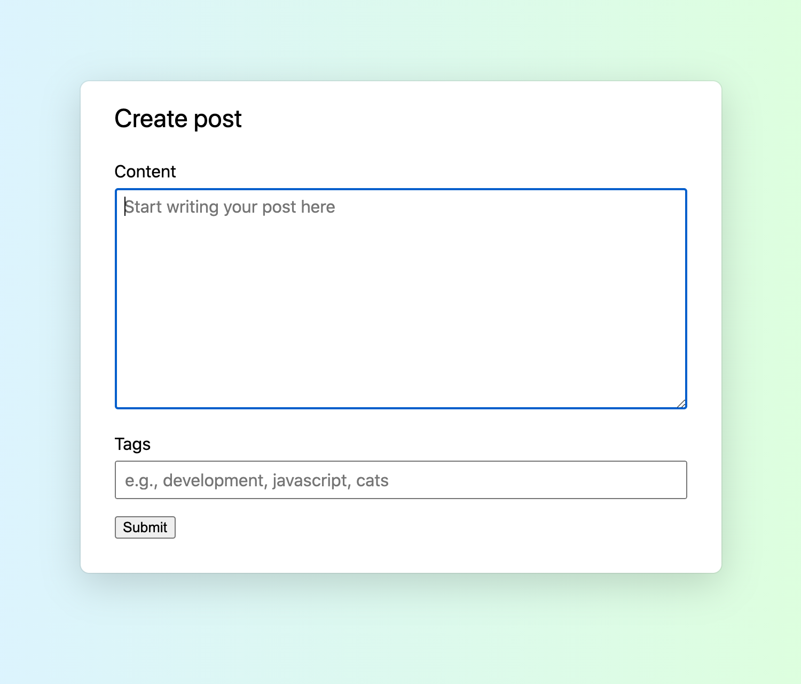

But there was a bug---in some cases, clicking the clicking on the `input` labelled "Tags" would cause the modal to close.

Reproduction steps:

- Use Chrome or Edge (No bug in Firefox or Safari)
- Starting editing the textarea labelled "Content."
- Click the "Tags" input.

**Expected result**: The "Tags" input focuses.

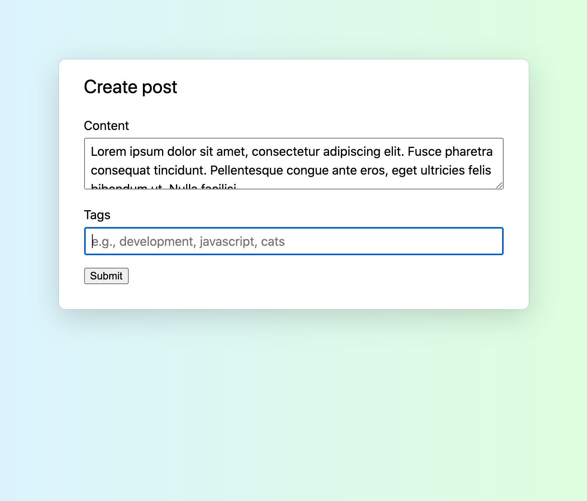

- **Actual result**: The "Tags" input briefly focuses, then the modal disappears. :(

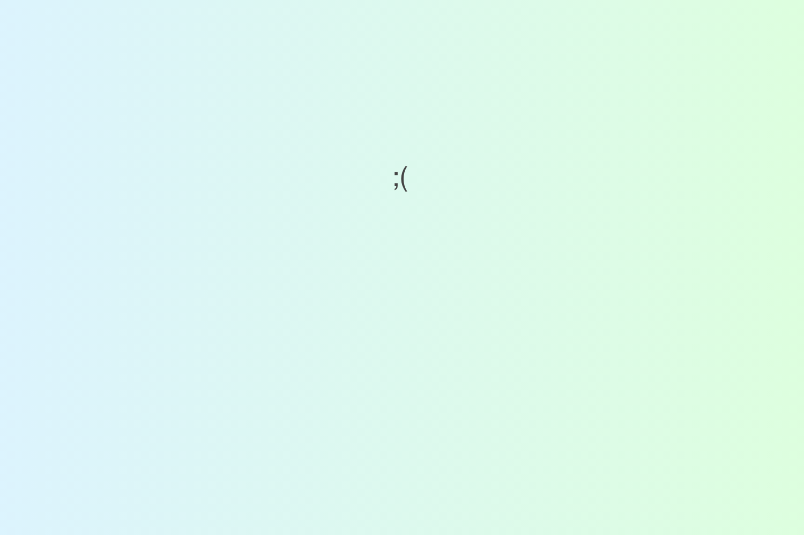

## Why is this happening to me??

I started by finding the code that caused the modal to close. It looked something like this:

```js
document.addEventListener("click", function onClick(event) {
  if (isElementOutsideOfModal(event.target)) {
    closeContainer();
  }
});
```

You can think of this code as saying “whenever the user clicks outside of the modal, close the modal.”

<InfoBlock>
  <EventTargetInfo />
</InfoBlock>

### What did I actually click on?

It was odd to me that this code was closing the modal. I had clicked on the input element inside the modal, so why did the browser think I was clicking outside of the modal?

To investigate further, I logged `event.target` to see on which element the browser thought the click event occurred.

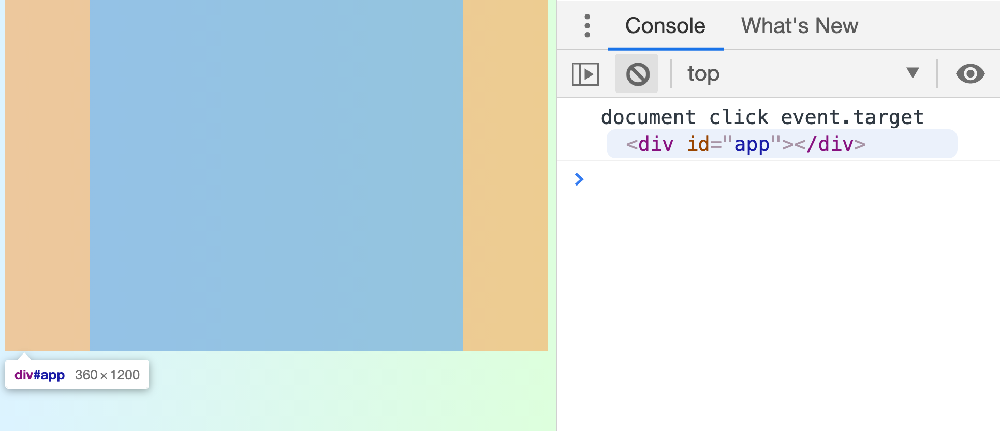

It was `#app`, a container for most of the page. I was surprised, because I thought `event.target` would be the input element I had clicked on.

If you look closer at the repro steps, however, you’ll notice something. When I _press_ the mouse button, it’s on the input:

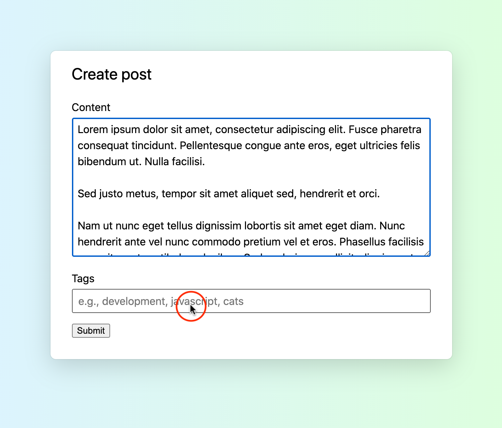

But when I _release_ the mouse button, it's _outside of the modal_, since the "Content" textarea only stays expanded while focused.

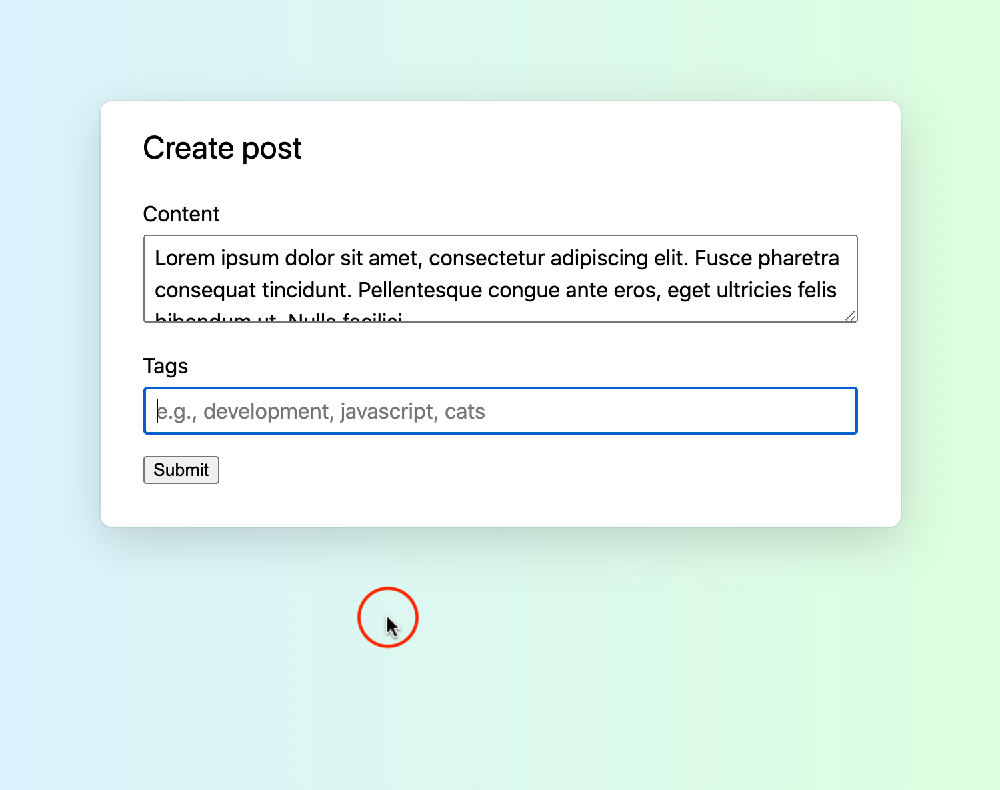

Huh! Looks like we found our "click outside of the modal."

### How is event.target determined for click events?

Does that observation mean that `event.target` for `click` events is determined by where the mouse button is released? Not quite:

> If the button is pressed on one element and the pointer is moved outside the element before the button is released, the event is fired on the most specific ancestor element that contained both elements.

—[MDN on the click event](https://developer.mozilla.org/en-US/docs/Web/API/Element/click_event)

## Why did this bug only exist in Chrome?

### Exploration with a minimal working example

<!-- html page in /static -->

To get there, I started by making a demo app of the bug <a href="/click-event-target/minimal-working-example/index.html" target="_blank" rel="noopener noreferrer">(try it out)</a>. With less code and a simpler app, it’d be easier to pinpoint the differences.

My demo app would show a red circle where I pressed the mouse, then another red circle where I released the mouse, then print `event.target`. It looked like this:

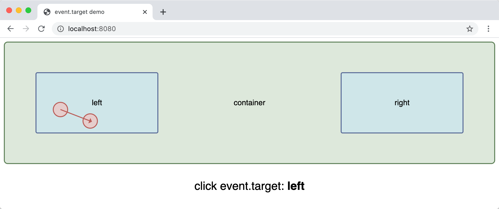

In that case, `event.target` was the `left` div, which makes sense. I pressed and released the mouse button in that same div, so the “common ancestor” of `left` and `left` is itself.

I tried it again, but I dragged the mouse from `left` to `right` before releasing:

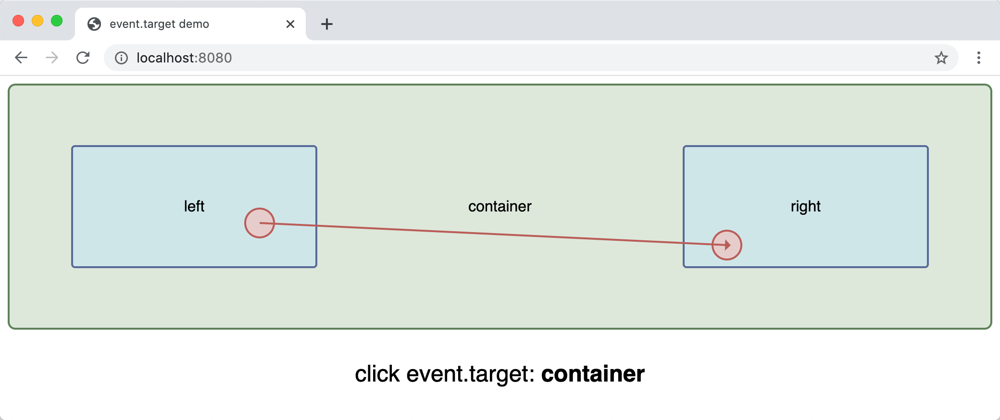

As we expected, `event.target` was `container`, the common ancestor of the `left` div (where I pressed the mouse) and the `right` div (where I released the mouse).

Chrome, Edge, Firefox, and Safari all had this same behavior. I was hoping to find a difference here, one that could explain the browser-specific bug I was fixing. Because I couldn’t find a difference, it seemed like my “demo app” wasn’t quite representative of the actual bug.

To make my demo app more accurate, I pulled in another detail from the actual bug I was trying to fix: Clicking on an `input` element instead of a `div`.

I added a `left-input` input element inside the `left` div.

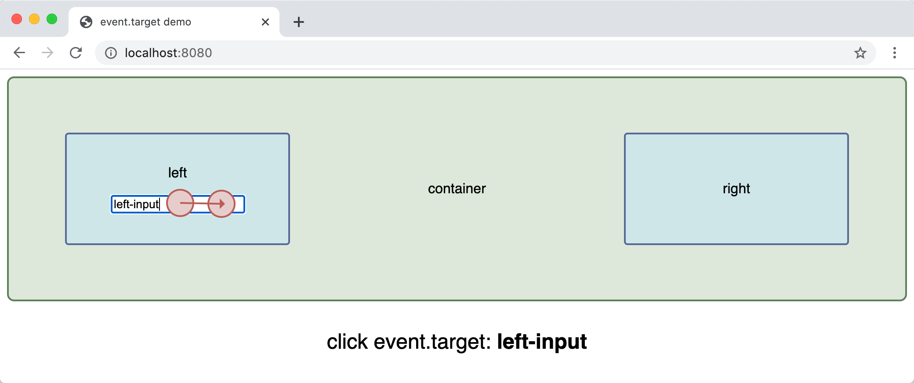

Looks good so far.

### Browser behavior differences

After that, I tried something closer to the original bug: Press the mouse on the left-input, then release it outside of the left container. Here is how it behaved in each browser:

#### Chrome

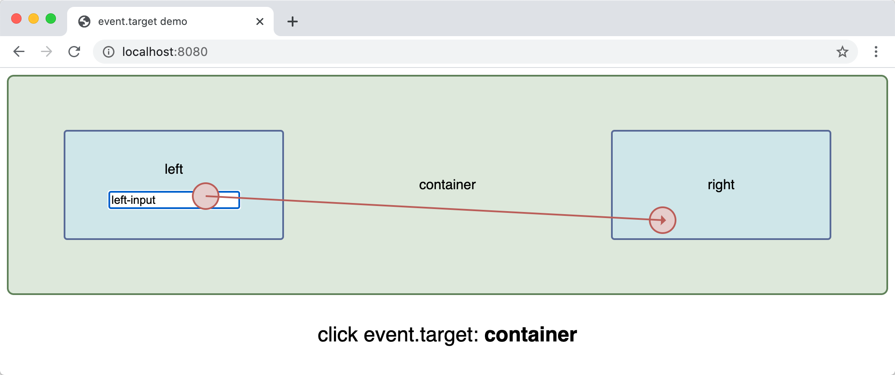

#### Firefox

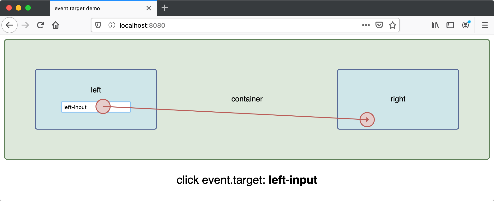

#### Safari

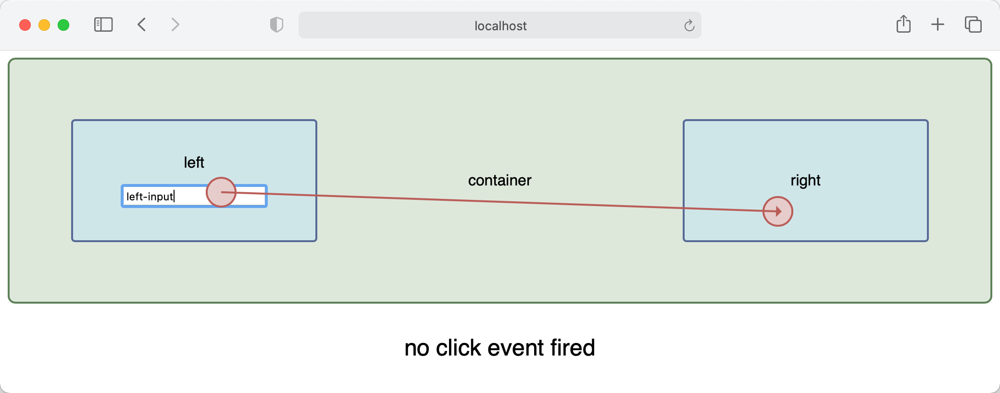

_Hmmmm._

It appears that `event.target`, specifically for input elements, behaves differently in Chrome than in Firefox and Safari.

That behavior difference is the source of our Chrome-only bug. If you press the mouse button on an `input` element, `event.target` is always that `input` element in Firefox, regardless of where you release the mouse. Safari didn't even fire a click event at all. But in Chrome or Edge, `event.target` depends on where you release your mouse.

## How can we fix it?

In this specific situation, we added a workaround. In the click handler, we'd check if an input was focused before closing the modal.

```js
document.addEventListener("click", function onClick(event) {
  if (!isElementOutsideOfModal(document.activeElement)) {
    return;
  }

  if (isElementOutsideOfModal(event.target)) {
    closeContainer();
  }
});
```

It was a low-risk change we could ship quickly within legacy code, but I imagine there are plenty of other solutions.
